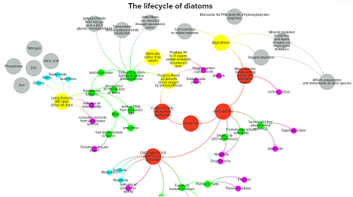
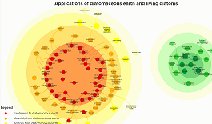
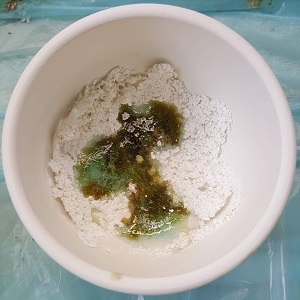

# 
Diatoms

<a href="#popup1">
The Lifecycle and applications of diatoms
</a>

  <h2>The Lifecycle and applications of diatoms</h2>
  <a class="close" href="#">&times;</a>
  

    As part of a module on material driven design on the masters in design for emergent futures course I researched a type of algae called diatoms that have extraordinary intricate glass shells with exceptional properties. When living, their class shells help them to photosynthesise carbon dioxide efficiently and they store energy mostly as oil. This map links these properties and processes throughout the diatom lifecycle to understand how these organisms might be used in material design.

  <iframe
    src="https://embed.kumu.io/e5c6952460b3a3fcef7a08c3d8b11a81"
    width="940" height="600" frameborder="0"></iframe>

<a href="#popup2">
Making materials from fossilised and living diatoms
</a>

  <hpopup>Map of materials from fossilised and living diatoms</hpopup>
  <a class="close" href="#">&times;</a>
  

<iframe
  src="https://embed.kumu.io/c3899a201f8e7b28eb10e7ca825ebe1f"
  width="940" height="600" frameborder="0"></iframe>

  See the Pen <a href="https://codepen.io/dissimulate/pen/dJgMaO/">
  Jelly</a> by dissimulate (<a href="https://codepen.io/dissimulate">@dissimulate</a>)
  on <a href="https://codepen.io">CodePen</a>.

<a href="#popup3">
Making glass from diatomaceous earth
</a>

  <hpopup>Title</hpopup>
  <a class="close" href="#">&times;</a>
  

