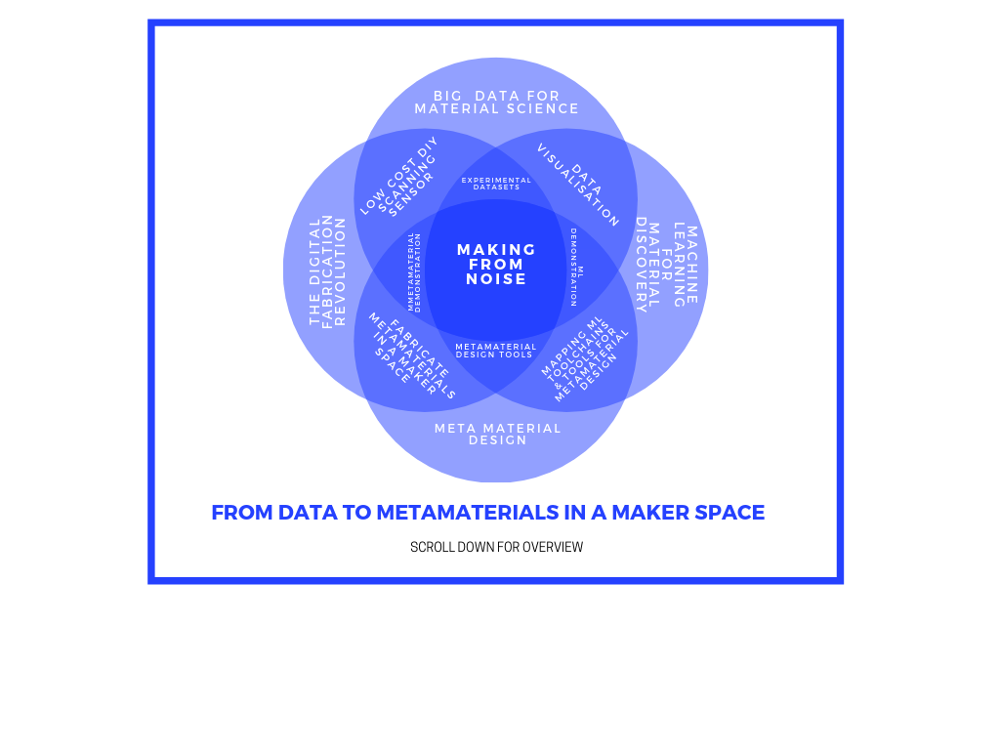
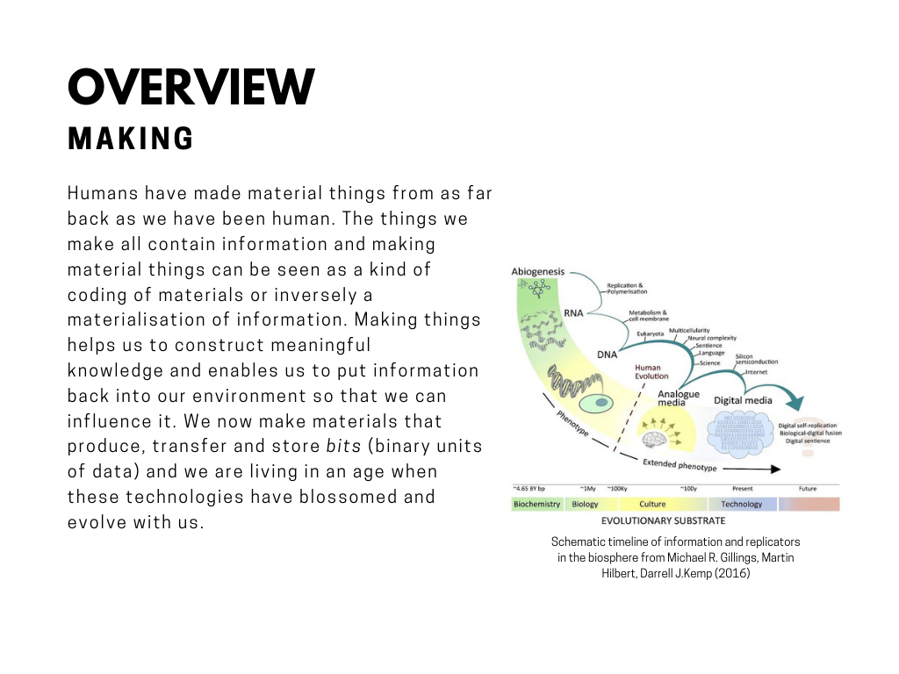
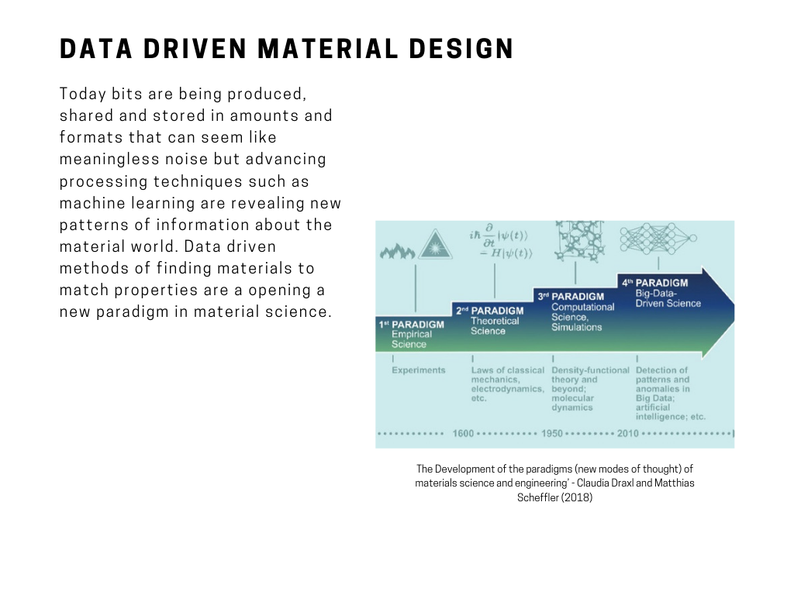
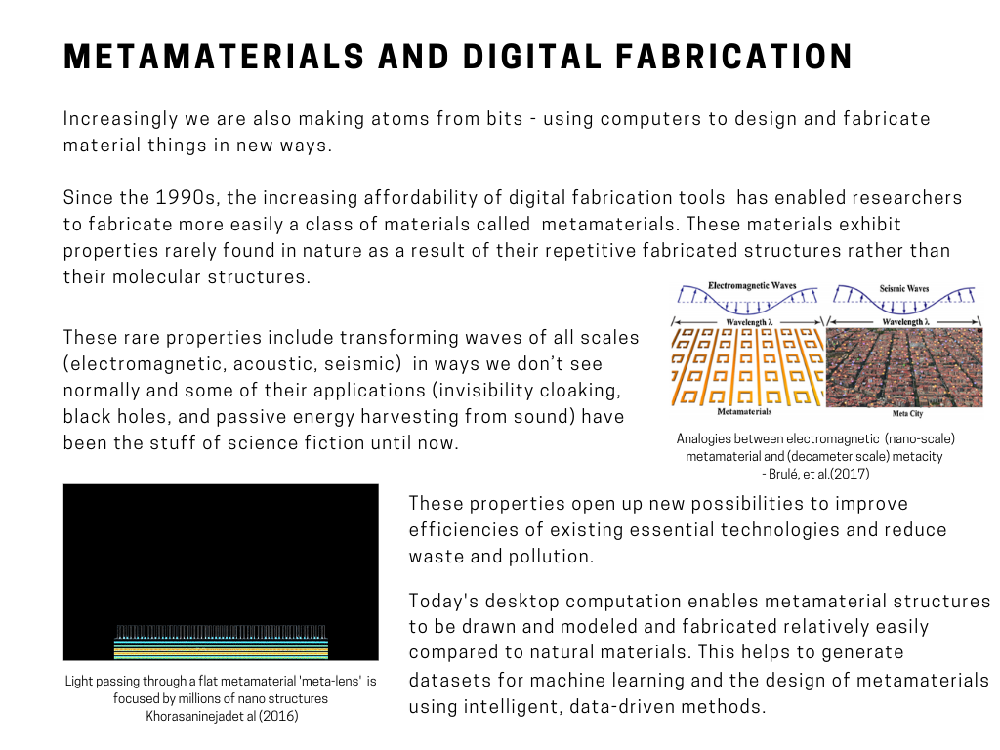
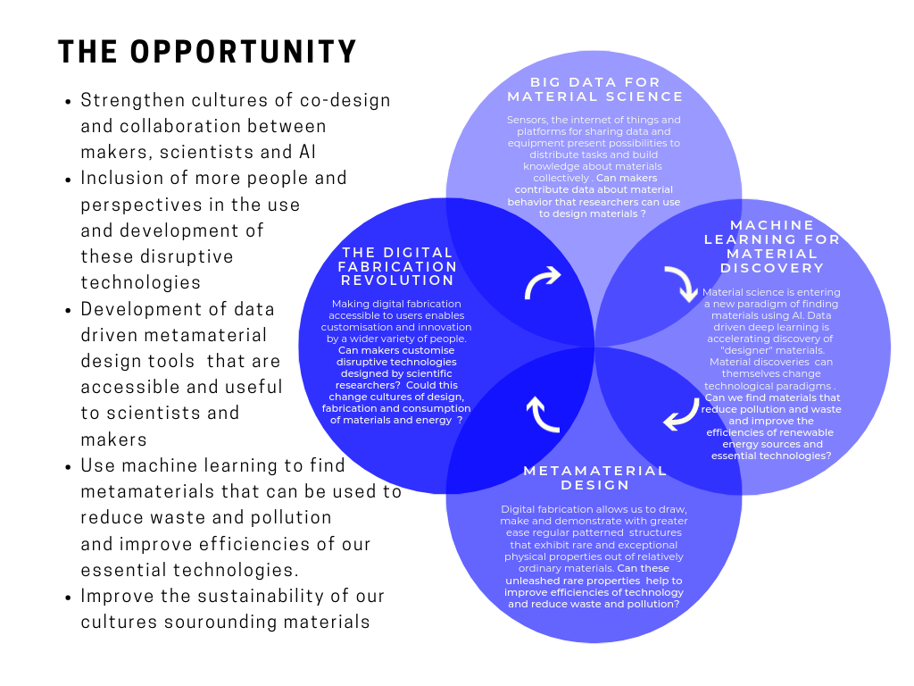
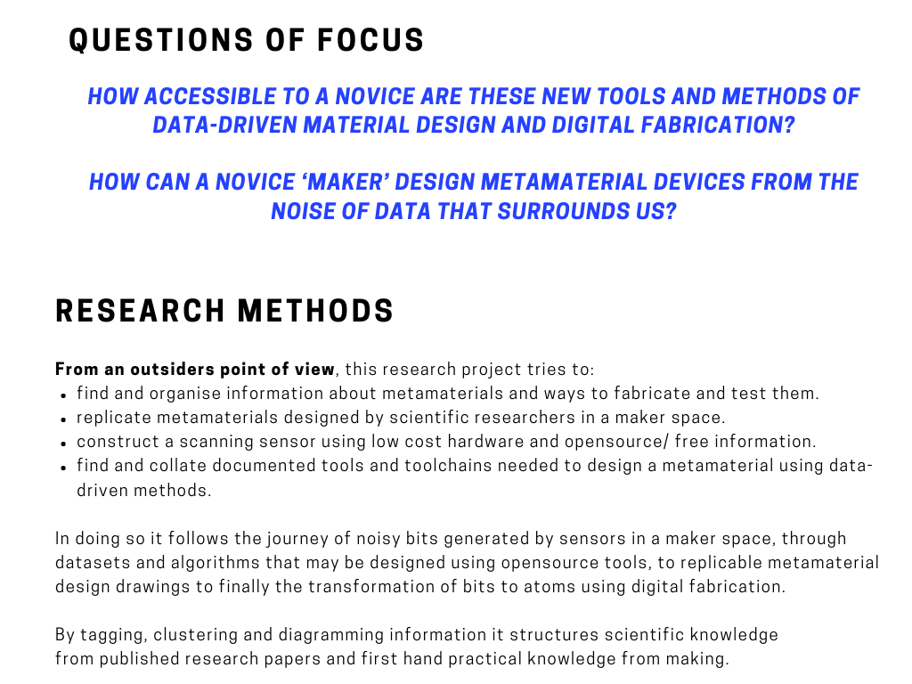
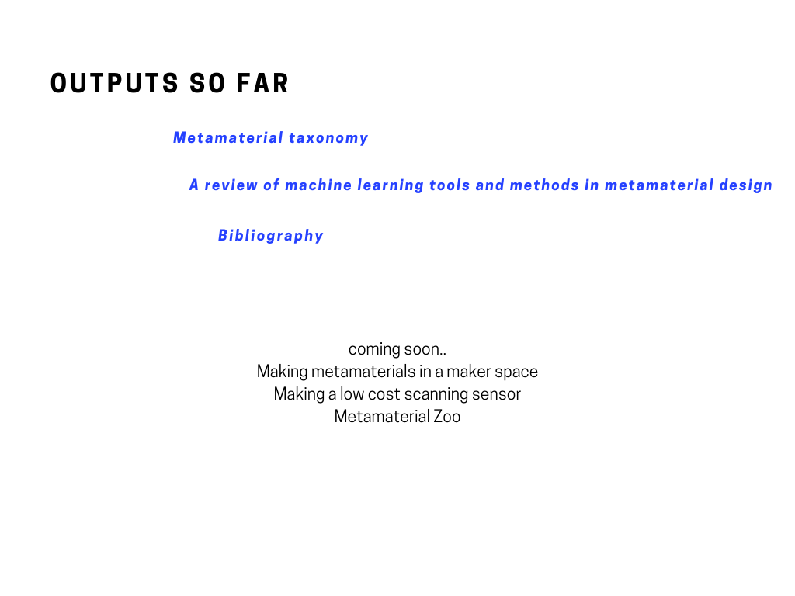
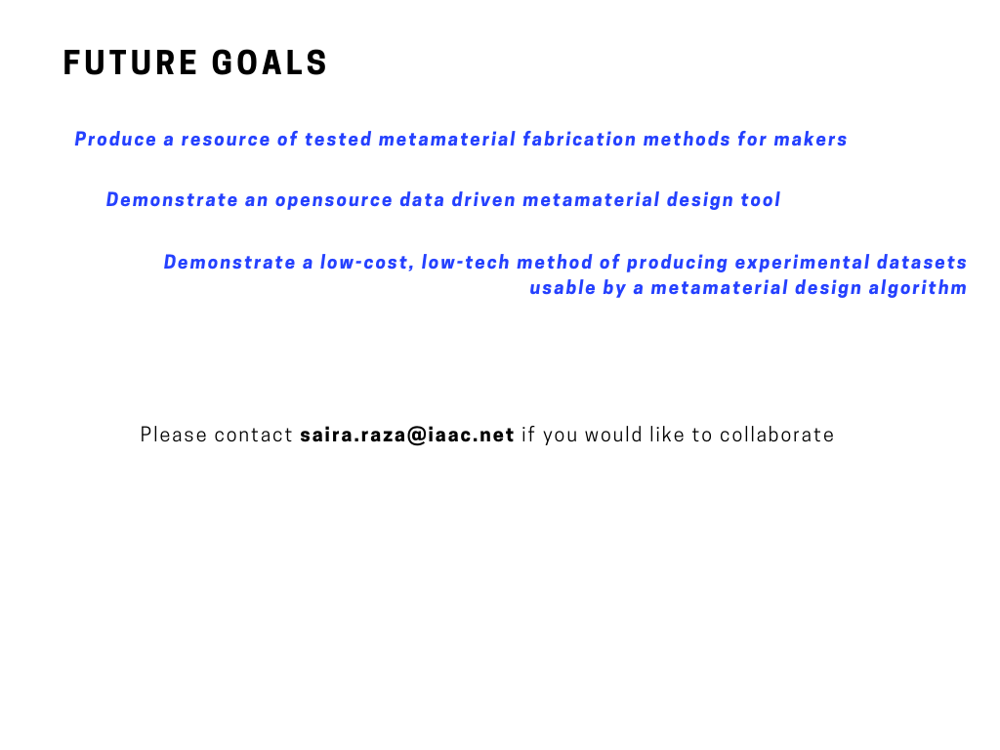

**
░M░a░k░i░n░g░ ░f░r░o░m░ ░n░o░i░s░e░̚
**

𝘍𝘳𝘰𝘮 𝘥𝘢𝘵𝘢 𝘵𝘰 𝘮𝘦𝘵𝘢𝘮𝘢𝘵𝘦𝘳𝘪𝘢𝘭𝘴 𝘪𝘯 𝘢 𝘮𝘢𝘬𝘦𝘳 𝘴𝘱𝘢𝘤𝘦

 

github.com/labnol/files/hello.pdf?raw=true

https://sairaraza.github.io/assets/mfnintro.pdf

assets/mfnintro.pdf
sairaraza.github.io/assets/mfnintro.pdf

