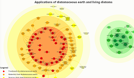
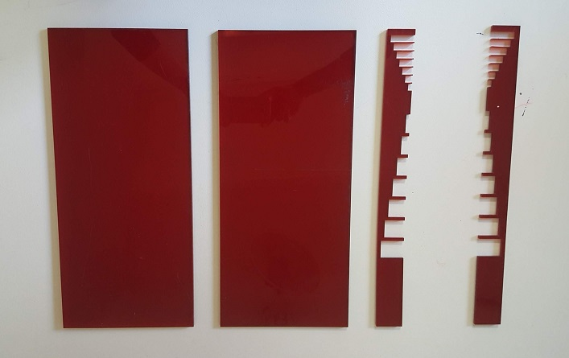
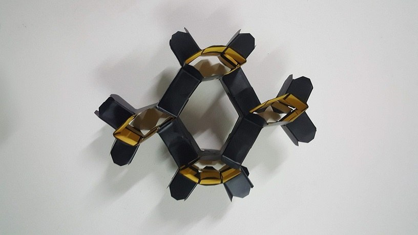

<head>

</head>

<body>

<h1>
Materials
</h1>

  

    

    

      <a href="#" data-filter="*" class="current">All Categories</a>
      <a href="#" data-filter=".webTemplates">Diatoms</a>
      <a href="#" data-filter=".logos">LMetamaterials</a>
      <a href="#" data-filter=".drawings">Drawings</a>
      <a href="#" data-filter=".ui">UI Elements</a>
    

      

    

      

        
      

      

        
      

      

        
      

      

        
      

      

        
      

      

        
      

      

        
      

      

        
      

      

        
      

      

        
      

      

        
      

      

        
      

    

  

<h2>Diatoms</h2>

  
<a href="#popup1">
  
The Lifecycle and applications of diatoms
</a>

  

  

  <hpopup>The Lifecycle and applications of diatoms</hpopup>
  <a class="close" href="#">&times;</a>
  
As part of a module on material driven design on the masters in design for emergent futures course I researched a type of algae called diatoms that have extraordinary intricate glass shells with exceptional properties. When living, their class shells help them to photosynthesise carbon dioxide efficiently and they store energy mostly as oil. This map links these properties and processes throughout the diatom lifecycle to understand how these organisms might be used in material design.
  <iframe
    src="https://embed.kumu.io/e5c6952460b3a3fcef7a08c3d8b11a81"
    width="940" height="600" frameborder="0"></iframe>

    

    

    

  
<a href="#popup2">
    
    
Making materials from fossilised and living diatoms

    </a>

    

    
<hpopup>Map of materials from fossilised and living diatoms</hpopup><a class="close" href="#">&times;</a>
    

      <iframe
        src="https://embed.kumu.io/c3899a201f8e7b28eb10e7ca825ebe1f"
        width="940" height="600" frameborder="0"></iframe>

    

    

    

 

 
 
 
 

<h2>Metamaterials</h2>

<a href="#popup3">
A Taxonomy of Metamaterials
</a>

  <hpopup>A Taxonomy of Metamaterials</hpopup>
  <a class="close" href="#">&times;</a>
  
This is a work in progress to map classifications of metamaterials based on physical effects and geometries.

  <iframe
  src="https://embed.kumu.io/941643c6f84d7e3f388272ddf1b05338"
  width="940" height="600" frameborder="0"></iframe>

    

    

  

<a href="#popup4">

Acoustic labyrinthine space-coiling metamaterial
</a>

<hpopup>Acoustic labyrinthine space-coiling metamaterial</hpopup>
<a class="close" href="#">&times;</a>
  

  
 

  
3 meta atoms of an acoustic labyrinthine type space-coiling acoustic metamaterial designed by <a href="https://www.sciencedirect.com/science/article/abs/pii/S1359645419302447">Dong et al (2018)</a> 3D printed using PLA. The original design was 5 meta atoms deep and 20 wide and formed a 'Superlens' which improves resolution by going beyond the diffraction limit we observe in ordinary lenses.

    

  

<a href="#popup5">
A laser cut 2D acoustic tunnel
</a>

  

  <hpopup>A laser cut 2D acoustic tunnel</hpopup>
  <a class="close" href="#">&times;</a>
  
 

  <a href="https://aip.scitation.org/doi/10.1063/1.4930300">Zhu, Zou, Liang, & Cheng (2015)</a> designed and fabricated an acoustic one-way open tunnel (or diode) by 3D printing two comb-like surfaces with ABS plastic and sealing them on top and bottom to form a tunnel. I attempted to replicate this using laser cut acrylic and have yet to confirm if the tunnel blocks sound of 6064 Hz as it is designed to.

  

  

  

<a href="#popup6">
Transformable metamaterial using vinyl cu
</a>

  

  <hpopup>Transformable metamaterial using vinyl cut</hpopup>
  <a class="close" href="#">&times;</a>
    

     4 vinyl cut units of transformable metamaterial waveguide designed by
    <a href="https://www.researchgate.net/publication/310766212_Reconfigurable_origami-inspired_acoustic_waveguides"> Babaee, Overvelde, Chen, Tournat & Bertol (2016)</a>
    

    

  

