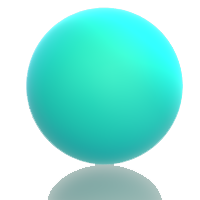

<head>

<link rel="shortcut icon" type="image/x-icon" href="fav.png">

<!--

<a href="#popup1">

second codeblock with no set dimensions
</a>

<a href="#popup1">
third block with overlay
</a>

<a href="#popup1">fourth text link</a>

-->

<section class="stripe">

<h6>About</h6>

I am researcher with a background in mechanical engineering and experience in finding insights from data, literature and through co-creation for NGOs and media organisations.

I am interested in relationships between data, structure and materials and how these could be used to make design cultures more sustainable and inclusive. This has led to an interest in finding opportunities for non-scientists to work with scientists in knowledge building, vision-building and co-creation. 

</section>

<section class="stripe2">

<h6>Contact</h6>

Please email sairarazaresearch@gmail.com for examples of work while this site is being completed..

</section>
