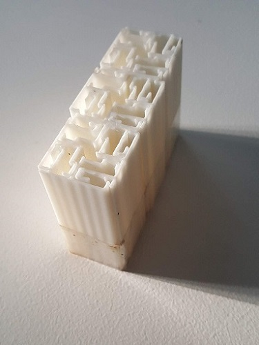

<head>

</head>

<body>

<h1>
Materials
</h1>

  <!-- Made possible by the great work of David DeSandro @ https://masonry.desandro.com -->
  <!-- Part 1: Add the scripts -->
  <!-- Step 1: Let's start by loading jQuery. jQuery is not required for masonary to function but makes things easier  -->

<!-- Step 2: Then load imagesloaded. imagesloaded makes sure the images are not displayed until they are fully loaded -->
  <!-- Step 3: we load masonry -->

  <!-- Part 2: Create the grid -->
  <!-- Step 1: Start with a the main grid wrapper-->
  

    <!-- Step 2: Add grid items--->
  

<a href="#popup1">
  
The Lifecycle and applications of diatoms
</a>

  

  

  

  <hpopup>The Lifecycle and applications of diatoms</hpopup>
  <a class="close" href="#">&times;</a>
  
As part of a module on material driven design on the masters in design for emergent futures course I researched a type of algae called diatoms that have extraordinary intricate glass shells with exceptional properties. When living, their class shells help them to photosynthesise carbon dioxide efficiently and they store energy mostly as oil. This map links these properties and processes throughout the diatom lifecycle to understand how these organisms might be used in material design.
  <iframe
    src="https://embed.kumu.io/e5c6952460b3a3fcef7a08c3d8b11a81"
    width="940" height="600" frameborder="0"></iframe>

    

    

    

  

<a href="#popup2">
  
  
Making materials from fossilised and living diatoms

  </a>

  

  

  
<hpopup>Map of materials from fossilised and living diatoms</hpopup><a class="close" href="#">&times;</a>
  

    <iframe
      src="https://embed.kumu.io/c3899a201f8e7b28eb10e7ca825ebe1f"
      width="940" height="600" frameborder="0"></iframe>

  

  

  

    <!-- Step 3: repeat...--->
  

<a href="#popup3">
  
A Taxonomy of Metamaterials
</a>

  

  

  <hpopup>A Taxonomy of Metamaterials</hpopup>
  <a class="close" href="#">&times;</a>
  
This is a work in progress to map classifications of metamaterials based on physical effects and geometries.

  <iframe
  src="https://embed.kumu.io/941643c6f84d7e3f388272ddf1b05338"
  width="940" height="600" frameborder="0"></iframe>

    

    

    

  

<a href="#popup4">
  
Acoustic labyrinthine space-coiling metamaterial
</a>

  

  

  <hpopup>Acoustic labyrinthine space-coiling metamaterial</hpopup>
  <a class="close" href="#">&times;</a>
  

  
 

  
3 meta atoms of an acoustic labyrinthine type space-coiling acoustic metamaterial designed by <a href="https://www.sciencedirect.com/science/article/abs/pii/S1359645419302447">Dong et al (2018)</a> 3D printed using PLA. The original design was 5 meta atoms deep and 20 wide and formed a 'Superlens' which improves resolution by going beyond the diffraction limit we observe in ordinary lenses.

  

  

  

  

<!-- Part 3: the script call -->

<!-- Now that everything is loaded we create a script to trigger masonary on $grid. Note that this simply says: "if the images are fully loaded, trigger masnory on $grid. -->

</body>
