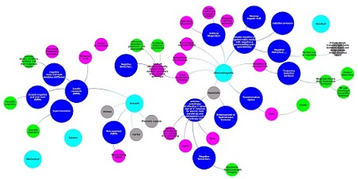

<head>
  <meta charset="utf-8">
  <meta name="viewport" content="width=device-width, initial-scale=1">
  
</head>

<body>

# 
Materials

  

  

<a href="#popup1">
    
The Lifecycle and applications of diatoms
</a>

  

  

  

    <h2>The Lifecycle and applications of diatoms</h2>
    <a class="close" href="#">&times;</a>
    
As part of a module on material driven design on the masters in design for emergent futures course I researched a type of algae called diatoms that have extraordinary intricate glass shells with exceptional properties. When living, their class shells help them to photosynthesise carbon dioxide efficiently and they store energy mostly as oil. This map links these properties and processes throughout the diatom lifecycle to understand how these organisms might be used in material design.
    <iframe
      src="https://embed.kumu.io/e5c6952460b3a3fcef7a08c3d8b11a81"
      width="940" height="600" frameborder="0"></iframe>
  

  

  

  

    
  

  

    
  

  

    
  

  

    
  

  

    
  

  

    
  

  

    
  

  

    
  

  

    
  

  

    
  

  

    
  

  

    
  

  

    
  

  

    
  

  

    
  

  

    
  

  

    
  

  

    
  

  

    
  

  

    
  

  

    
  

  

    
  

  

    
  

  

    
  

  

    
  

  

    
  

  

    
  

  

    
  

  

    
  

  
Created with &#10084; with <a href="//w3bits.com/tools/masonry-generator/" target="_blank" rel="external noopener nofollow">CSS Masonry Generator</a>

  

<a href="#popup2">
Making materials from fossilised and living diatoms
</a>

  <hpopup>Map of materials from fossilised and living diatoms</hpopup>
  <a class="close" href="#">&times;</a>
  

<iframe
  src="https://embed.kumu.io/c3899a201f8e7b28eb10e7ca825ebe1f"
  width="940" height="600" frameborder="0"></iframe>

<a href="#popup3">
A Taxonomy of Metamaterials
</a>

  <h2>A Taxonomy of Metamaterials</h2>
  <a class="close" href="#">&times;</a>
  

  This is a work in progress to map classifications of metamaterials based on physical effects and geometries.

  <iframe
  src="https://embed.kumu.io/941643c6f84d7e3f388272ddf1b05338"
  width="940" height="600" frameborder="0"></iframe>

<a href="#popup4">
Acoustic labyrinthine space-coiling metamaterial
</a>

<h3>Acoustic labyrinthine space-coiling metamaterial</h3>
<a class="close" href="#">&times;</a>

 

3 meta atoms of an acoustic labyrinthine type space-coiling acoustic metamaterial designed by <a href="https://www.sciencedirect.com/science/article/abs/pii/S1359645419302447">Dong et al (2018)</a> 3D printed using PLA. The original design was 5 meta atoms deep and 20 wide and formed a 'Superlens' which improves resolution by going beyond the diffraction limit we observe in ordinary lenses.

</body>
</html>
