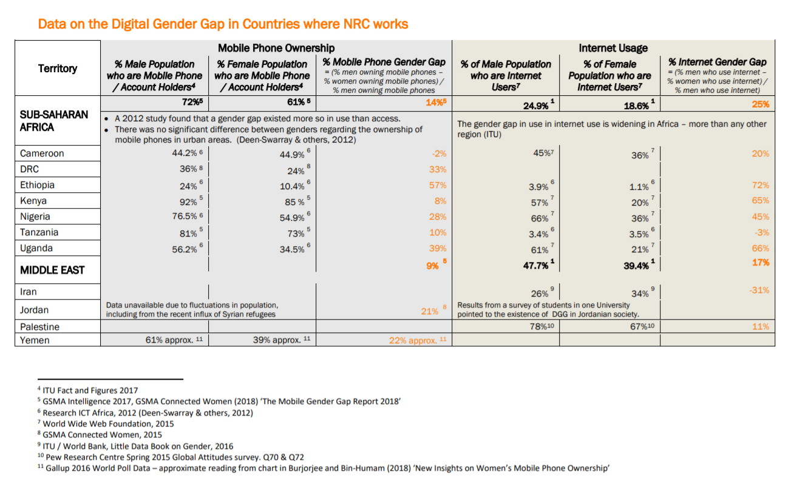

<head></head>

# 
Examples of research outputs

## Mapping

### The Lifecycle and applications of diatoms

<dl class="list">

<dt><b>Research for</b></dt>
<dd>Material Driven Design module on the Design for Emergent Futures masters at IAAC</dd>

<dt><b>Introduction</b></dt>
<dd> I researched a type of algae called diatoms that have extraordinary intricate glass shells with exceptional properties. As well as this, when living, their glass shells help them to photosynthesise carbon dioxide efficiently and they store energy mostly as oil. This map links these properties and processes throughout the diatom lifecycle to understand how these  might be used in technology or for inspiration.</dd>

<dt><b>Tools used</b></dt>
<dd>Google Scholar, Kumu.io</dd>
</dl>

<iframe
  src="https://embed.kumu.io/e5c6952460b3a3fcef7a08c3d8b11a81"
  width="940" height="600" frameborder="0"></iframe>

   
   
   

## Applications of fossilised and living diatoms

<dl class="list">

<dt><b>Research for</b></dt>
<dd>Material Driven Design module on the Design for Emergent Futures masters at IAAC</dd>

<dt><b>Introduction</b></dt>
<dd>I built this map from research found online of ways of transforming fossilised and living diatoms into other materials and known applications of these materials</dd>

<dt><b>Tools used</b></dt>
<dd>Google Scholar, Kumu.io</dd>
</dl>

<iframe
src="https://embed.kumu.io/c3899a201f8e7b28eb10e7ca825ebe1f"
width="940" height="600" frameborder="0"></iframe>

### Mapping weak signals using scraped keywords from linked websites

<dl class="list">

<dt><b>Research for</b></dt>
<dd>Atlas of Weak Signals module on the Design for Emergent Futures masters at IAAC</dd>

<dt><b>Introduction</b></dt>
<dd>This is a clustered map of keywords scraped from urls my classmates had to listed for different research topics that the class was given weak signals of future changes. The results were not largely meaningful but taught us something about the data scraping process.</dd>

<dt><b>Tools used</b></dt>
<dd>Algorithmia machine learning platform, Excel, Kumu.io</dd>
</dl>

<iframe
  src="https://embed.kumu.io/48df0cf878258c1f7fa66c5f524996c8"
  width="940" height="600" frameborder="0"></iframe>

### A taxonomy of metamaterials (in progress)

<dl class="list">

<dt><b>Research for</b></dt>
<dd>Atlas of Weak Signals module on the Design for Emergent Futures masters at IAAC</dd>

<dt><b>Introduction</b></dt>
<dd> This is also a work in progress looking to build a taxonomy of metamaterials based on physical effects and geometries.</dd>

<dt><b>Tools used</b></dt>
<dd>Online search, Kumu.io</dd>
</dl>

  <iframe
    src="https://embed.kumu.io/6825075ec137d3c33b229bcb12321379"
    width="940" height="600" frameborder="0"></iframe>

    ### Machine learning tools for finding metamaterials

    <dl class="list">

    <dt><b>Research for</b></dt>
    <dd>Final Project for Design for Emergent Futures masters at IAAC</dd>

    <dt><b>Introduction</b></dt>

    <dd>Below is a work in progress visualisation of machine learning tools used for material discovery that might be able to form a toolchain for the inverse design of metamaterials..</dd>

    <dt><b>Tools used</b></dt>
    <dd>Kumu.io</dd>
    </dl>

    <iframe
      src="https://embed.kumu.io/dd0eabb8de78689badf9e3d0331b1886"
      width="940" height="600" frameborder="0"></iframe>

      #### Mapping interesting geometries in scientific research

      Early on in the course I used this space to store interesting structures that I had found as inspiration for structures that I might be able to model, fabricate or research later in the course.

        <iframe
          src="https://embed.kumu.io/97f492e6eee87fc3f2f13802d8141d90"
          width="940" height="600" frameborder="0"></iframe>

## Processes

### Building a training dataset

Below is a diagram showing the different ways of obtaining  datasets described in research papers on using deep learning to inverse design materials.

### Learning about Machine Learning

Outside of looking at existing research on the use of machine learning in material design I am continuing to read about machine learning to understand why certain tools are used in this field.

<iframe
  src="https://embed.kumu.io/3026594c431b45b869df0b2a5fc06769"
  width="940" height="600" frameborder="0"></iframe>

## Repositories

### A collection of details of experiments on metamaterial designs

<dl class="list">

<dt><b>Research for</b></dt>
<dd>Final Project for Design for Emergent Futures masters at IAAC</dd>

<dt><b>Introduction</b></dt>
<dd>A place to collect methods of experiments to demonstrate metamaterials with a view to understand hoe to fabricate them and the equipment necessary to demonstrate their effect</dd>

<dt><b>Tools used</b></dt>
<dd>Airtable</dd>
</dl>

<iframe class="airtable-embed" src="https://airtable.com/embed/shr8y8TN7JjYMJomL?backgroundColor=red&viewControls=on" frameborder="0" onmousewheel="" width="100%" height="533" style="background: transparent; border: 1px solid #ccc;"></iframe>

 

### A list of scientific research papers on inverse design of metamaterials using deep learning

<dl class="list">

<dt><b>Research for</b></dt>
<dd>Final Project for Design for Emergent Futures masters at IAAC</dd>

<dt><b>Introduction</b></dt>
<dd>I created this space with a view to document methods and tools of inverse designing metamaterials using machine learning with a view to find ways to test a method myself. These are taken from a wider review of inverse design in computational material science..</dd>

<dt><b>Tools used</b></dt>
<dd>Kumu.io</dd>
</dl>

<iframe class="airtable-embed" src="https://airtable.com/embed/shr53SklTZpDwo9Ku?backgroundColor=red&viewControls=on" frameborder="0" onmousewheel="" width="100%" height="533" style="background: transparent; border: 1px solid #ccc;"></iframe>

## Documenting projects

<!--
### Finding project intervention paths

  This was a tool to collect and link themes of interest explored in the MDEF course with design approaches and narratives in order to form a preliminary proposal for my final project

  <iframe
    src="https://embed.kumu.io/270e7094435b7b71af9d0c28dcf47cd3"
    width="940" height="600" frameborder="0"></iframe>
    -->

#### Finding an intervention path as a group

<dl class="list">
<dt><b>Research for</b></dt>
<dd>Atlas of Weak Signals module on the Design for Emergent Futures masters at IAAC</dd>

<dt><b>Introduction</b></dt>
<dd>This exercise was a group exercise to propose interventions around the theme of materials and link them to themes explored in the masters course..</dd>

<dt><b>Tools used</b></dt>
<dd>Kumu.io</dd>
</dl>

  <iframe
    src="https://embed.kumu.io/3aa3fc2400e7da8dd1efcb3beb695681"
    width="940" height="600" frameborder="0"></iframe>

<!--
#### Mapping projects in the MDEF course

This map was a start to map all projects in our class against the weak signals they respond to.

  <iframe
    src="https://embed.kumu.io/cd20ae775492be0ec478baee36c0d5b0"
    width="940" height="600" frameborder="0"></iframe>
    -->

### Links between WASH infrastructure and completion of primary education

<dl class="list">
<dt><b>Research for</b></dt>
<dd>Norwegian Refugee Council</dd>

<dt><b>Introduction</b></dt>
<dd>The following illustration was the result of keyword searching 160 field studies as part of a report commissioned by NRC. The report can be downloaded [here](https://gitlab.com/MDEF/2018/saira.raza/raw/master/docs/assets/SAIRA%20RAZA%20WASH%20and%20Schools%20Report%20211215.pdf?inline=false).</dd>

<dt><b>Tools used</b></dt>
<dd>Photoshop</dd>
</dl>

## Synthesis reports

### Report on ICTs for emergency health communication

<dl class="list">
<dt><b>Research for</b></dt>
<dd>Norwegian Refugee Council</dd>

<dt><b>Introduction</b></dt>
<dd>This report synthesized findings of specified research items around the use of information communication technologies in emergency health messaging. The format of the findings to be kept</dd>
<dt><b>Tools used</b></dt>
<dd></dd>
</dl>

[Download report here](https://gitlab.com/MDEF/2018/saira.raza/raw/master/docs/assets/SAIRA%20RAZA%20RHP_Synthesis%20Report_v12%20052018.pdf?inline=false)

Below is a summary table of data I was asked to compile on the digital gender gap in countries where NRC work and recommendations from desk research on how to tackle this gap.

I was asked to write a short blog post on ways to address the digital gender divide based on recommendations from practitioners which can be read [here](https://www.rethinking-hygienepromotion.com/blog/2018/9/6/7-ways-to-address-the-digital-gender-gap)

### Visualising the links between digital fabrication and computational material science

<dl class="list">

<dt><b>Research for</b></dt>
<dd>Final Project for Design for Emergent Futures masters at IAAC</dd>

<dt><b>Introduction</b></dt>
<dd> A visualisation of the links between tools of computational material science and digital fabrication that I had encountered from research papers for my masters project.</dd>

<dt><b>Tools used</b></dt>
<dd>Kumu.io</dd>
</dl>

[back](./)
