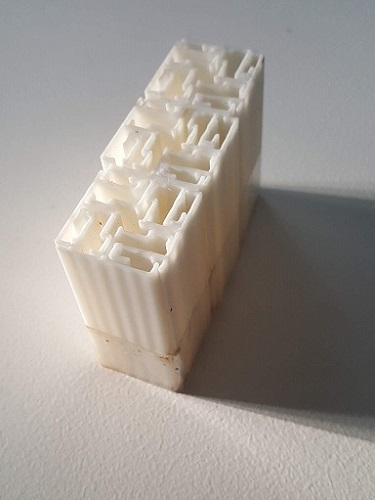
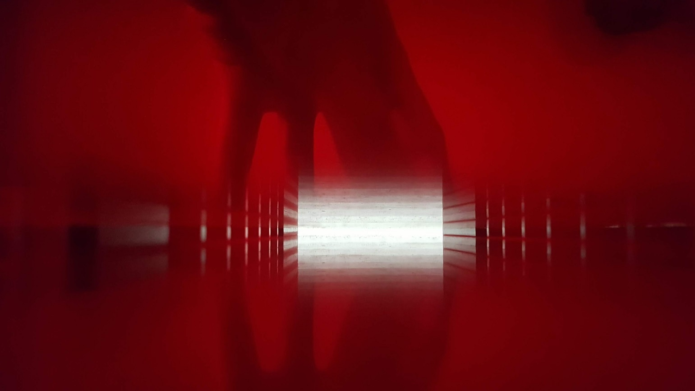
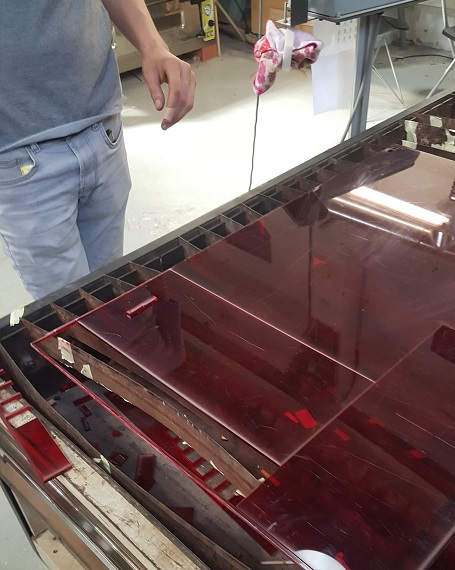
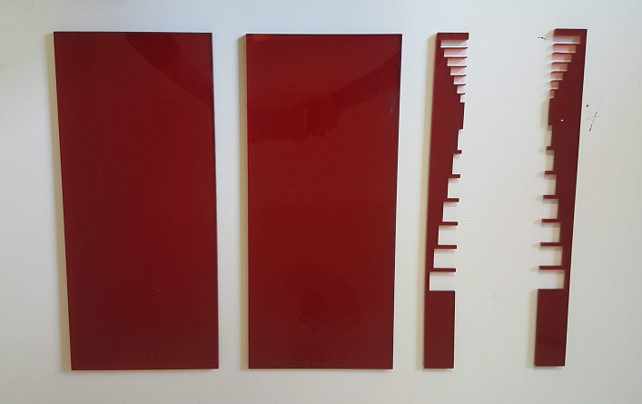
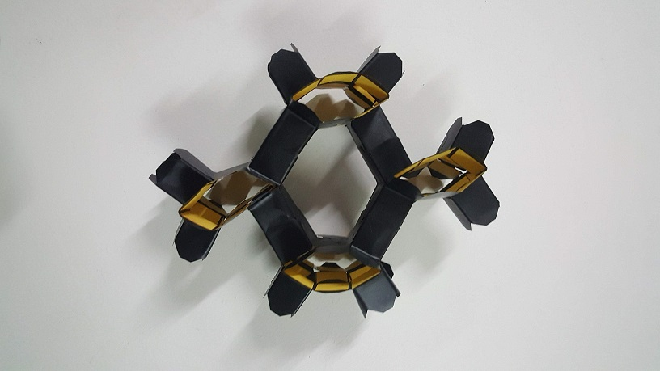
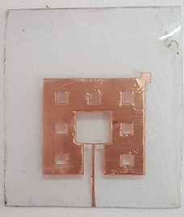

<head>

</head>
<body>

<h1>Materials</h1>

<a href="#mms1">
A Taxonomy of Metamaterials
</a>

  <h2>A Taxonomy of Metamaterials</h2>
  <a class="close" href="#">&times;</a>
  

  This is a work in progress to map classifications of metamaterials based on physical effects and geometries.

  <iframe
    src="https://embed.kumu.io/714c3ea8325f9f79049f05f1daddf434"
    width="940" height="600" frameborder="0"></iframe>

<a href="#mms1">
Making glass from diatomaceous earth
</a>

  <h2>A Taxonomy of Metamaterials</h2>
  <a class="close" href="#">&times;</a>
  

  This is also a work in progress looking to bring together taxonomies of metamaterials based on physical effects and geometries.

  <iframe
    src="https://embed.kumu.io/6825075ec137d3c33b229bcb12321379"
    width="940" height="600" frameborder="0"></iframe>

<a href="#mms2">
A collection of details of experiments on metamaterial designs
</a>

  <h2>A Taxonomy of Metamaterials</h2>
  <a class="close" href="#">&times;</a>
  

I am in the process of completing data from research papers on experiments that test metamaterial designs to enable to show the metadevices that can be made and the tools to test them.

<iframe class="airtable-embed" src="https://airtable.com/embed/shr8y8TN7JjYMJomL?backgroundColor=red&viewControls=on" frameborder="0" onmousewheel="" width="100%" height="533" style="background: transparent; border: 1px solid #ccc;"></iframe>

<a href="makingmetamaterials">
Making metamaterials
</a>

<a href="#popup4">
Acoustic labyrinthine space-coiling metamaterial
</a>

<h3>Acoustic labyrinthine space-coiling metamaterial</h3>
<a class="close" href="#">&times;</a>

 

3 meta atoms of an acoustic labyrinthine type space-coiling acoustic metamaterial designed by <a href="https://www.sciencedirect.com/science/article/abs/pii/S1359645419302447">Dong et al (2018)</a> 3D printed using PLA. The original design was 5 meta atoms deep and 20 wide and formed a 'Superlens' which improves resolution by going beyond the diffraction limit we observe in ordinary lenses.

<a href="#popup4">
Acoustic labyrinthine space-coiling metamaterial
</a>

<a href="#popup5">
A laser cut 2D acoustic tunnel
</a>

<h3>A laser cut 2D acoustic tunnel</h3>
<a class="close" href="#">&times;</a>

<a href="https://aip.scitation.org/doi/10.1063/1.4930300">Zhu, Zou, Liang, & Cheng (2015)</a> designed and fabricated an acoustic one-way open tunnel (or diode) by 3D printing two comb-like surfaces with ABS plastic and sealing them on top and bottom to form a tunnel. I attempted to replicate this using laser cut acrylic and have yet to confirm if the tunnel blocks sound of 6064 Hz as it is designed to.

<a href="#popup6">
Transformable metamaterial using vinyl cut
</a>

<h3>Transformable metamaterial using vinyl cut</h3>
<a class="close" href="#">&times;</a>

4 units of a vinyl cut transformable metamaterial designed by
<a href="https://www.researchgate.net/publication/310766212_Reconfigurable_origami-inspired_acoustic_waveguides"> Babaee, Overvelde, Chen, Tournat & Bertol (2016) </a>

<a href="#popup7">
Fractal Antenna meta atom using vinyl cut copper tape
</a>

<h3>Fractal Antenna meta atom using vinyl cut copper tape</h3>
<a class="close" href="#">&times;</a>

A Sierpinski fractal antenna design designed by <a href="https://www.researchgate.net/publication/270625606_A_New_Fractal-Based_Miniaturized_Dual_Band_Patch_Antenna_for_RF_Energy_Harvesting">Shrestha, Lee, & Choi (2014)</a>. Vinyl cut copper tape mounted on PVC

<h3></h3>
<a class="close" href="#">&times;</a>

 

3 meta atoms of an acoustic labyrinthine type space-coiling acoustic metamaterial designed by <a href="https://www.sciencedirect.com/science/article/abs/pii/S1359645419302447">Dong et al (2018)</a> 3D printed using PLA. The original design was 5 meta atoms deep and 20 wide and formed a 'Superlens' which improves resolution by going beyond the diffraction limit we observe in ordinary lenses.

</body>
