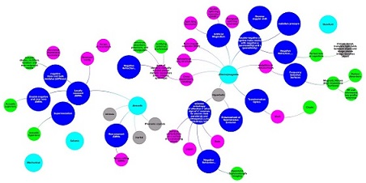
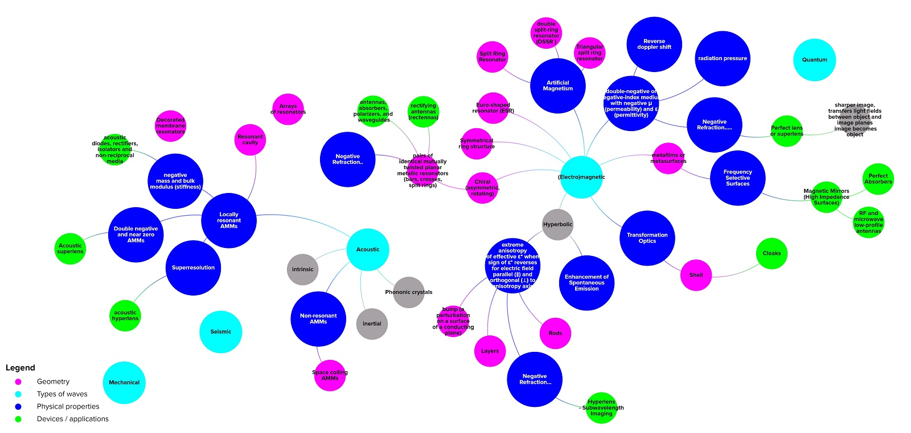
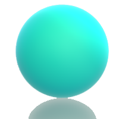
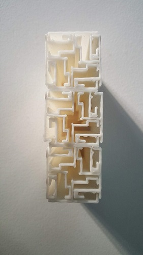

# 
Materials

<a href="#mms1">
A Taxonomy of Metamaterials
</a>

  <h2>A Taxonomy of Metamaterials</h2>
  <a class="close" href="#">&times;</a>
  

  This is a work in progress to map classifications of metamaterials based on physical effects and geometries.

  <iframe
    src="https://embed.kumu.io/714c3ea8325f9f79049f05f1daddf434"
    width="940" height="600" frameborder="0"></iframe>

<a href="#mms1">
Making glass from diatomaceous earth
</a>

  <h2>A Taxonomy of Metamaterials</h2>
  <a class="close" href="#">&times;</a>
  

  This is also a work in progress looking to bring together taxonomies of metamaterials based on physical effects and geometries.

  <iframe
    src="https://embed.kumu.io/6825075ec137d3c33b229bcb12321379"
    width="940" height="600" frameborder="0"></iframe>

<a href="#mms2">
A collection of details of experiments on metamaterial designs
</a>

  <h2>A Taxonomy of Metamaterials</h2>
  <a class="close" href="#">&times;</a>
  

I am in the process of completing data from research papers on experiments that test metamaterial designs to enable to show the metadevices that can be made and the tools to test them.

<iframe class="airtable-embed" src="https://airtable.com/embed/shr8y8TN7JjYMJomL?backgroundColor=red&viewControls=on" frameborder="0" onmousewheel="" width="100%" height="533" style="background: transparent; border: 1px solid #ccc;"></iframe>

<a href="makingmetamaterials">
Making metamaterials
</a>

<a href="#popup4">
Acoustic labyrinthine space-coiling metamaterial by Dong et al (2018)
</a>

  <h2>Acoustic labyrinthine space-coiling metamaterial by Dong et al (2018)</h2><a class="close" href="#">&times;</a>
  

  
 

  3 meta atoms of an acoustic labyrinthine type space-coiling acoustic metamaterial designed [Dong et al (2018)](https://www.sciencedirect.com/science/article/abs/pii/S1359645419302447) 3D printed using PLA. The original design was 5 meta atoms deep and 20 wide and formed a 'Superlens' which improves resolution by going beyond the diffraction limit we observe in ordinary lenses.

...
<noscript>Making glass from diatomaceous earthSome experiments to turn silica in diatomaceous earth into glassGlass from DEcameramake samsungfocallength 4.3height 300fnumber 1.9exposuretime 0.04orientation 1camerasoftware G920FXXU6ERF5originaldate 3/7/2019 8:38:49 PMwidth 307cameramodel SM-G920FWaterglassDE with Caustic soda and watercameramake samsungfocallength 4.3height 357fnumber 1.9exposuretime 0.02orientation 6camerasoftware G920FXXU6ERF5originaldate 2/14/2019 1:48:15 AMwidth 300cameramodel SM-G920FWaterglass glaze after firingWaterglass fired at 800 degrees C for 4 hourscameramake samsungfocallength 4.3height 274fnumber 1.9exposuretime 0.00091911765orientation 6camerasoftware G920FXXU6ERF5originaldate 2/15/2019 6:42:01 PMwidth 300cameramodel SM-G920FWaterglass DE and CaObefore firing cameramake samsungfocallength 4.3height 300fnumber 1.9exposuretime 0.02orientation 1camerasoftware G920FXXU6ERF5originaldate 2/18/2019 8:06:06 PMwidth 190cameramodel SM-G920F</noscript>
