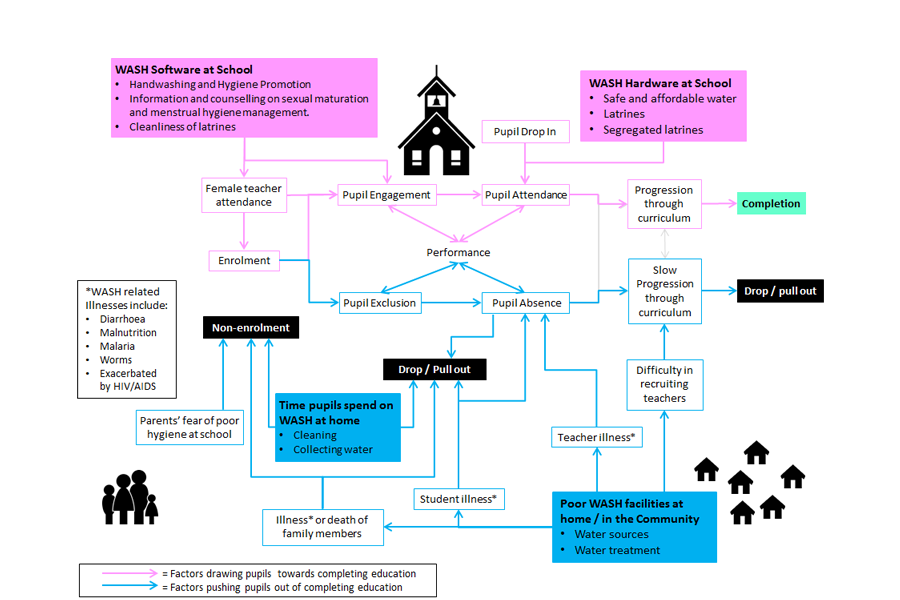

# 
Water and Sanitation

### Links between WASH infrastructure and completion of primary education

The following illustration was the result of keyword searching 160 field studies as part of a report commissioned by NRC. The report can be downloaded [here](https://gitlab.com/MDEF/2018/saira.raza/raw/master/docs/assets/SAIRA%20RAZA%20WASH%20and%20Schools%20Report%20211215.pdf?inline=false)

### Report on ICTs for emergency health communication

This report synthesized findings of specified research items around the use of information communication technologies in emergency health messaging. The format of the findings to be kept

[Download report here](https://gitlab.com/MDEF/2018/saira.raza/raw/master/docs/assets/SAIRA%20RAZA%20RHP_Synthesis%20Report_v12%20052018.pdf?inline=false)

Below is a summary table of data I was asked to compile on the digital gender gap in countries where NRC work and recommendations from desk research on how to tackle this gap.

I was asked to write a short blog post on ways to address the digital gender divide based on recommendations from practitioners which can be read [here](https://www.rethinking-hygienepromotion.com/blog/2018/9/6/7-ways-to-address-the-digital-gender-gap)

[back](./)
